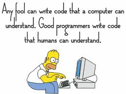
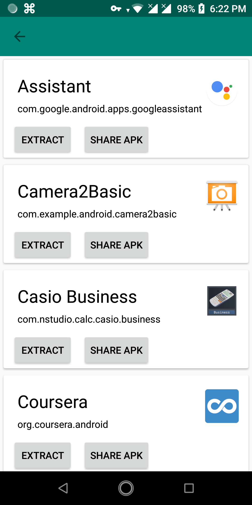

# MY README TEMPLATE 

> Used Programming languages/Libraries

[(https://developer.android.com/about/)

## Table of Contents
- [Installation](#Installation)
- [Steps](#Steps)
- [Description](#Description)
- [References](#References)
- [Tools](#Tools)
- [Feedback](#Get-Feedback)
- [Contribute](#Contribute)
- [License](#License)

## Installation
I used Android studio 3.2.1 in this project,but I will suggest you to use latest version of Android Studio.
Download and Install Android Studio from here - 
 [Download Android Studio](https://developer.android.com/studio/)
[↥ back to top](#table-of-contents)

## Steps  

- Launch Android Studio
- Create a new project
- I have used Java,no need to include c++ support
- Select an Empty project and finsh

[↥ back to top](#table-of-contents)

## Description
 *To be uploaded after the project is finished*

## Reference

- [You can see other Examples from here](https://developer.android.com/guide/) - *Developer Guides*

[↥ back to top](#table-of-contents)

## Get Feedback

 -	### Give me feed back here.That's very important 
	 - [My Email](#email) 
	 - [My Facebook ID](https://www.facebook.com/profile.php?id=100011440244328) - *feel free to ping*
 -  ### Me
 	

		
	

[↥ back to top](#table-of-contents)

## Contribute

Contributions are always welcome!
Please *create an issue if you find one*.

[↥ back to top](#table-of-contents)

## License

>License of the Project goes here.

[MIT](https://choosealicense.com/licenses/mit/)

[↥ back to top](#table-of-contents)
